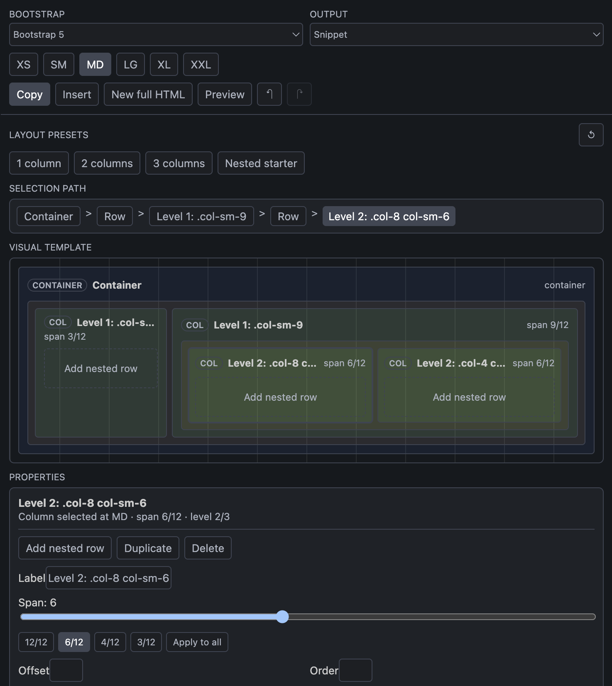
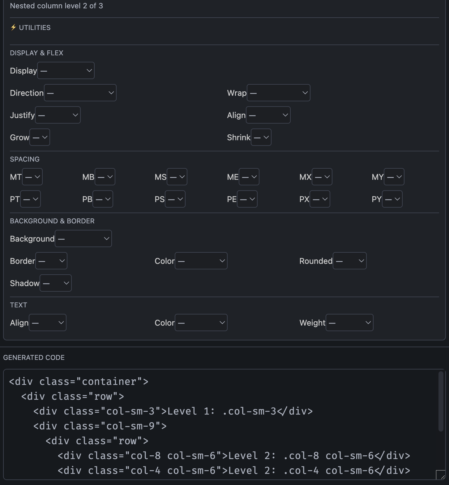

# BootFrame

**BootFrame** is a visual Bootstrap layout builder for developers who want to compose responsive HTML structures directly inside VS Code.

Instead of hand-writing every `container`, `row`, and `col` combination, **BootFrame lets you design Bootstrap layouts visually** and generate clean Bootstrap 4 or Bootstrap 5 code from the result.

## ✨ Key Features

### 1. 🧱 Visual Bootstrap Builder

Build responsive Bootstrap structures from a compact Activity Bar panel:

- **Containers:** Create standard, fluid, and responsive Bootstrap container layouts.
- **Rows & Columns:** Compose `container > row > col` structures visually.
- **Column Resizing:** Resize columns on the Bootstrap 12-column grid.
- **Nested Layouts:** Add rows inside columns to build deeper page structures.
- **Column Reordering:** Drag and reorder columns inside each row.
- **State Restore:** Continue working from the same layout when the BootFrame view reloads.

### 2. 📐 Responsive Layout Controls

BootFrame includes practical controls for common responsive Bootstrap patterns:

- **Bootstrap Version:** Generate Bootstrap 5 code by default, with Bootstrap 4 compatibility mode.
- **Breakpoints:** Configure spans, offsets, order, visibility, and gutters across responsive sizes.
- **Container Types:** Use Bootstrap 5 container variants such as `container-sm`, `container-md`, `container-lg`, `container-xl`, and `container-xxl`.
- **Utility Classes:** Apply display, flex, spacing, background, border, shadow, text alignment, text color, and font weight utilities.
- **Bootstrap 4 Compatibility:** Generate Bootstrap 4-friendly markup where class behavior differs.

### 3. 🧪 Preview & Code Generation

Design visually, inspect the generated HTML, and move it into your project quickly:

- **Live Preview:** Toggle between edit mode and a rendered Bootstrap preview.
- **Snippet Output:** Generate only the Bootstrap layout markup for insertion into an existing page.
- **Full HTML Output:** Generate a complete HTML document with Bootstrap assets included.
- **Copy Code:** Copy generated code to the clipboard.
- **Insert Into Editor:** Insert the generated markup at the active editor cursor.
- **Create HTML Document:** Open a new untitled HTML document with the generated layout.

### 4. ⚙️ Workspace Settings

Customize BootFrame from VS Code settings:

- **Default Bootstrap Version:** `bootframe.defaultVersion`
- **Default Output Mode:** `bootframe.defaultOutputMode`
- **Indent Size:** `bootframe.indentSize`
- **Undo History:** `bootframe.maxUndoHistory`
- **Bootstrap JS Bundle:** `bootframe.includeBootstrapJS`

---

## 🚀 How to Use

Once installed, BootFrame adds a dedicated icon to the VS Code Activity Bar.

Open the BootFrame panel, compose your layout visually, then choose whether to copy the generated code, insert it into the active editor, preview it, or create a new HTML document.

### Available Commands

Open the Command Palette (`Ctrl+Shift+P` or `Cmd+Shift+P`) and type:

- `BootFrame: Open BootFrame Builder`: Opens the visual Bootstrap builder.
- `BootFrame: Reset BootFrame Design`: Clears the current builder layout.

---

## 📸 Screenshots

## 🛡️ Privacy Policy

Your layout work stays local.

- **No Telemetry:** This extension does **not** send analytics or usage data to external servers.
- **Local State:** Builder state is restored locally through VS Code webview state.
- **Bootstrap Preview:** The preview and generated full HTML documents may reference Bootstrap CDN assets depending on the selected output options.

---

## 📝 License

MIT License — Copyright (c) 2026 DevBySergio

See the [LICENSE](LICENSE) file for details.

---

**Happy Building!** 🚀
